# **E-commerce Website**

This website offers an entire online shopping experience and is ready to be used, every order placed is stored in a Mongo data base and inside Redux store.

## **Dependencies:**

- React JS
- Next JS
- Redux Toolkit
- Redux Persist
- Framer Motion
- React Icons
- Mongo DB
- React Hook Form

First run npm install to add all the dependencies.

```bash
npm run dev
# or
yarn dev
# or
pnpm dev
```

Open [http://localhost:3000](http://localhost:3000) with your browser to see the result.

## **Sections:**

- **Header:** Composed by the logo, menu (toggle version on responsive) and cart.

  

- **Header Big:** The same as header but with a subheader with the name of the category.

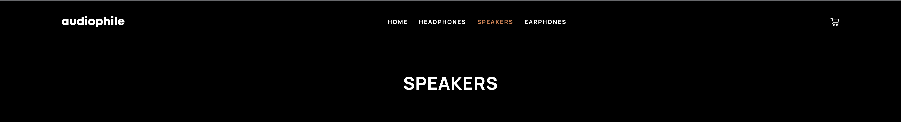

- **Footer:** Contains logo, small description, social links and menu links.

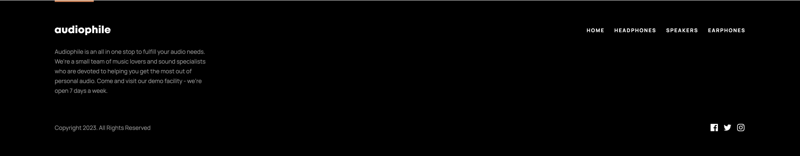

- **Categories:** Component that contains every category (each one represented with a picture).

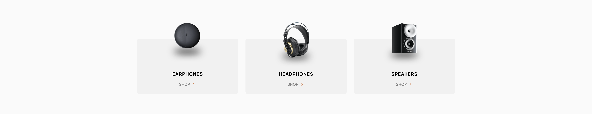

- **Slogan Banner:** A text with a background and description of the brand and a picture.


- **Checkout Form:** Form to enter details to place the order.

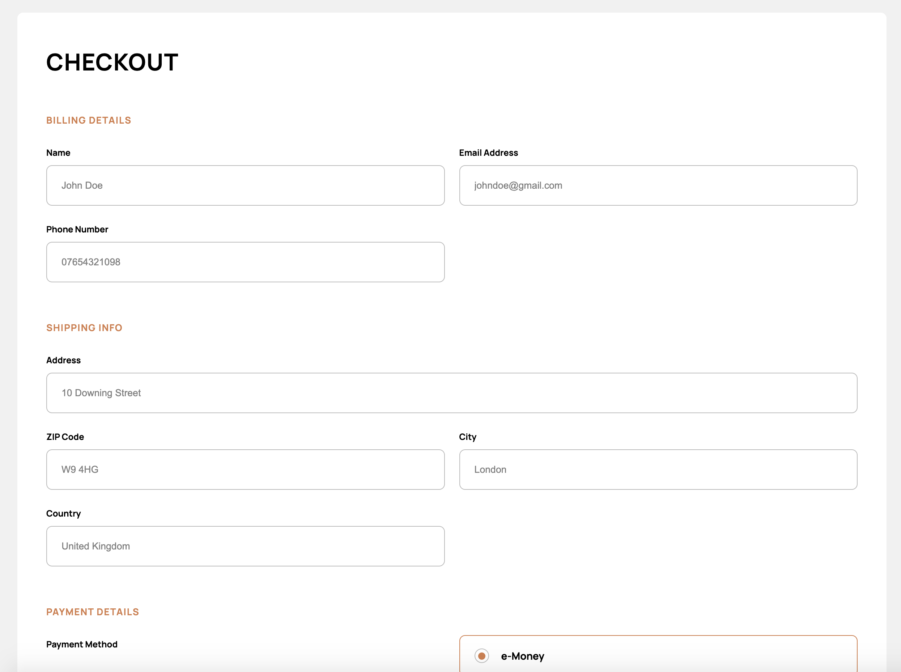

- **Order Summary:** A small summary of the order with the breakdown of price and pay button.

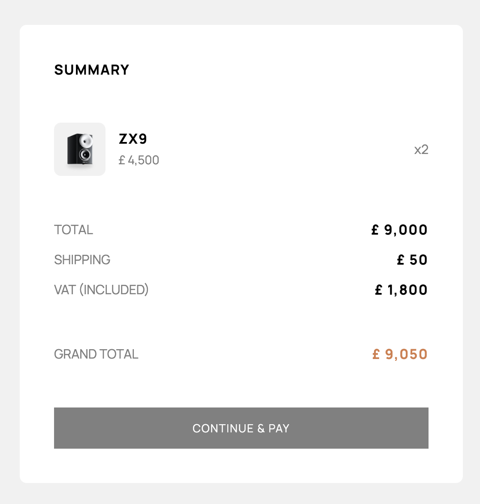

- **Order Confirmation Modal:** Modal that appears when an order has been submitted successfully.

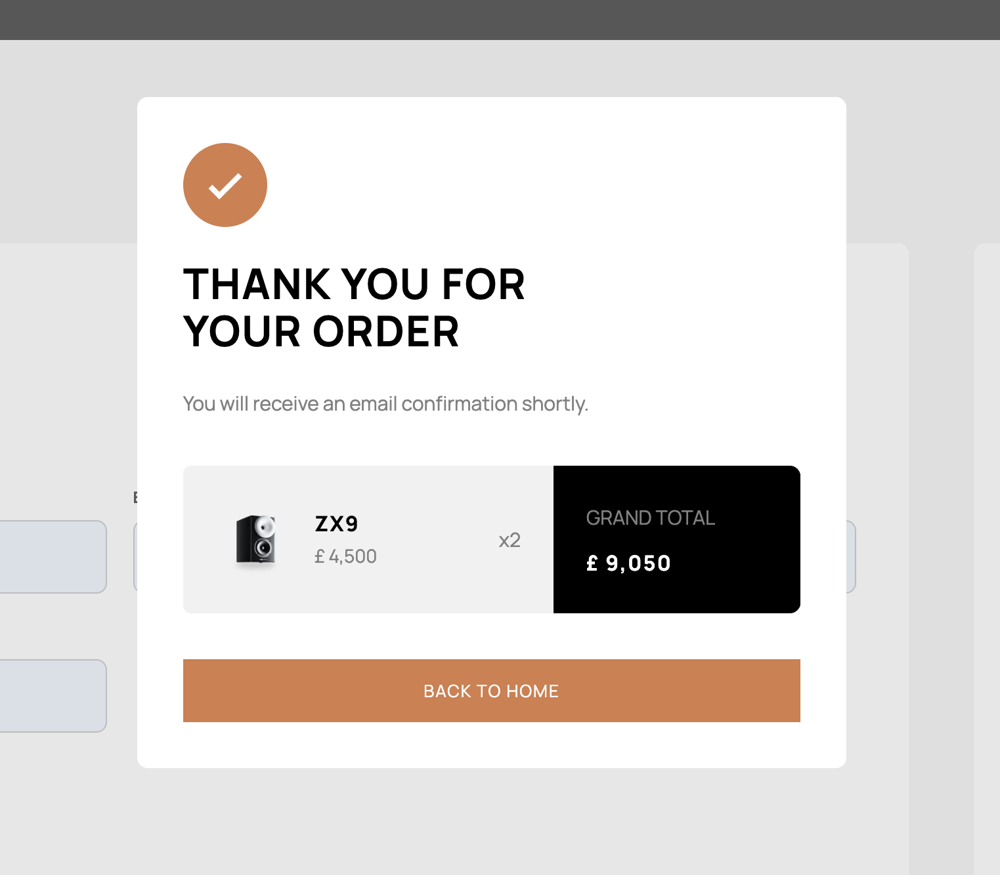

- **Highlighted Product:** Section with a featured product (picture and link to the product)

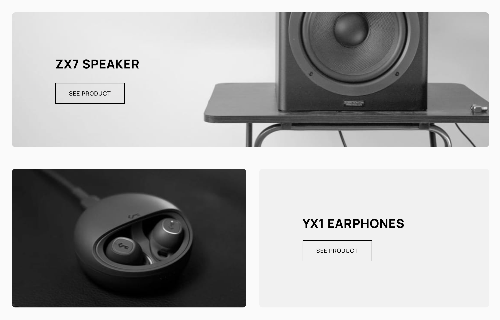

- **Hero Banner:** The main featured product, new addition or best seller.


- **Recommended Products:** Product recommendations based on the one you are looking at.

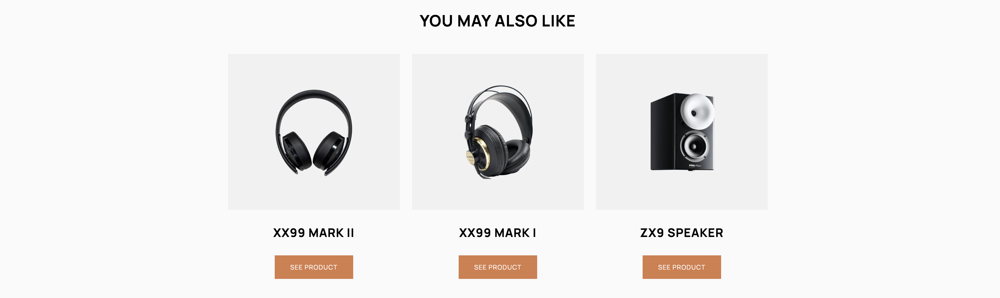

- **Product:** Picture, Name and description of the product, plus a button to add to cart (and a counter to select how many) or a button to see the product page, depending on where the component is.

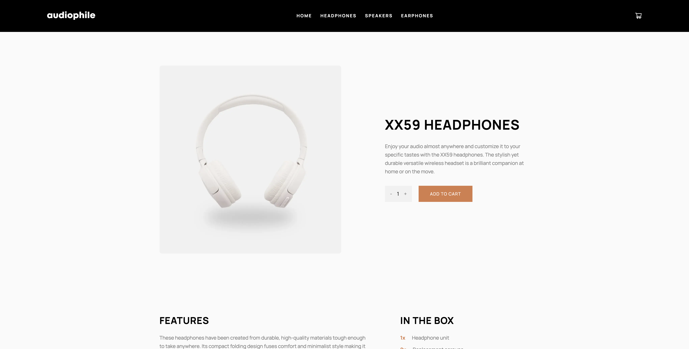

## **Pages:**

(Header and Footer are in every page)

- **Home:** This is the landing page and where everything starts. You will find the Hero Banner, 3 Highlighted Products, and the Slogan Banner.

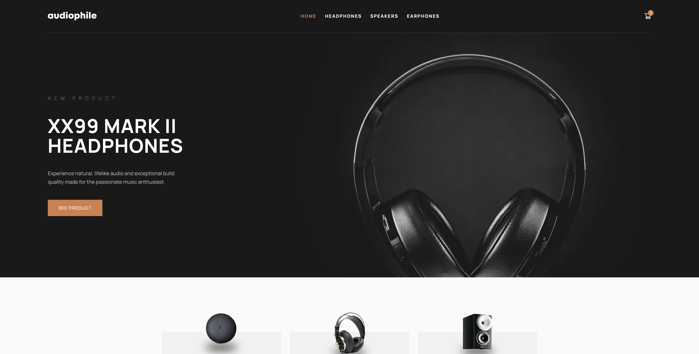

- **Category:** Contains Header big stating the name of the category, the list of the products inside that category with a button to the product page , Categories section, and Slogan Banner.

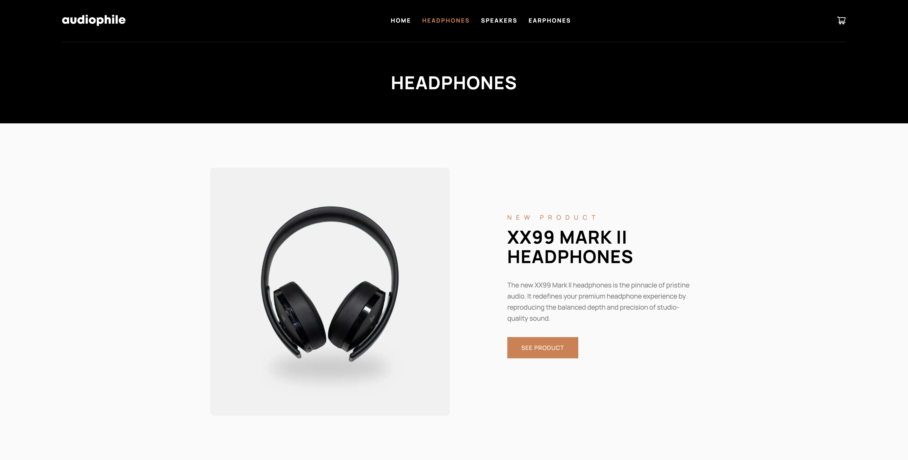

- **Product:** Product section with add to cart button (you can select how many), description of the features and what is in the box, a pictures gallery, Recommended Products section, Categories section and Slogan Banner section.


- **Cart:** This is a modal on the center of the screen with the products you have in the cart, total price, and you add, remove items that already are in the cart, clear cart and go to checkout.

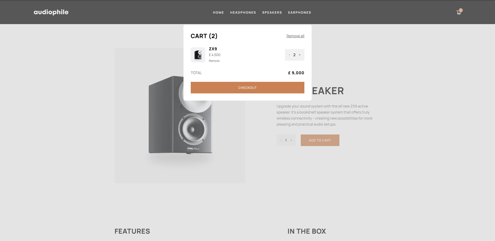

- **Checkout:** Here you will find the Checkout Form and Order Summary, once you place the order, the order confirmation modal will appear.

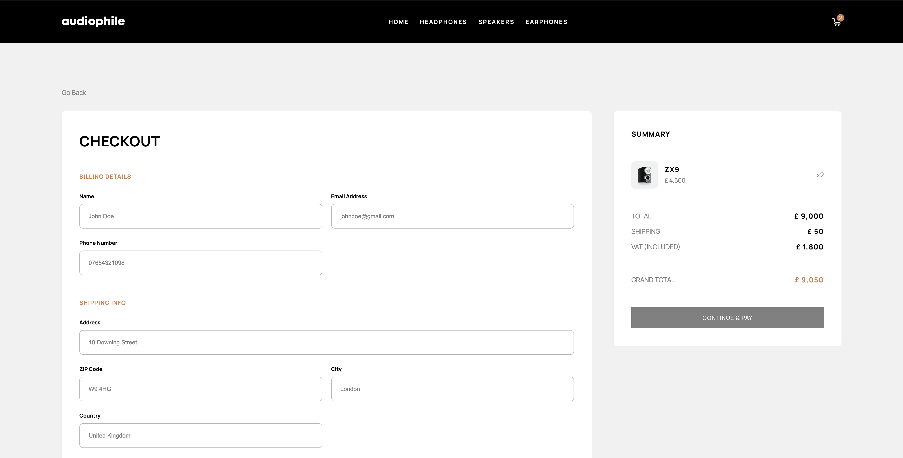

## Features:

- **Cart:** The cart is managed by redux toolkit, so the elements added are stored and accessible throughout the website. Prices are calculated inside the cartSlice, this will provide the sum of the total amount of the same item and the entire cart. This cart has the ability to add and remove items and recalculate quantity and total price on the fly. To persist the elements you have inside the cart when refreshing the site I have implemented Redux Persist. VAT is calculated in an isolated function just to calculate 20% of the total price.
- **Products:** All the products are stored in MongoDB. I created an endpoint (GET) in the api folder to fetch all the products from the data base. Product fetching is performed with getStaticProps, as this is a server sider rendering website (SSR), when you call an endpoint, has to be done on server side, never on client side, otherwise the page will render without the elements you are trying to fetch.
- **Orders:** Every order placed is stored in another collection in MongoDB, and for that I created another endpoint (POST). To call this endpoint I have created a custom hook that receive as parameters all the necessary data to submit the order.
- **Form:** The form is managed with React Hook Form, I created a validation schema to make sure the data submitted is in the correct format. Also, until the form is valid, the confirm & pay button will be disabled.
- **Screen Size Hook:** This custom hook is to calculate the size of the screen to conditionally fetch some images, depending on the device the user is accessing the website from.
- **Loading:** When the website is loading or transitioning to a different page, you will see a dark backdrop with a loading spinner, to let the user know that is currently loading. This has been created with context and use state, to conditionally set isLoading state to true or false. The loading spinner animation has been created with pure CSS, keyframes.

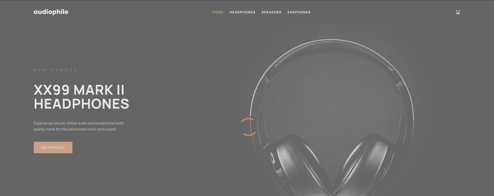

- **DOM elements transitions:** Framer motion is the technology used to create the subtle and smooth effects when elements are added or removed from the DOM.

This website is completely responsive and can be used on every device.
